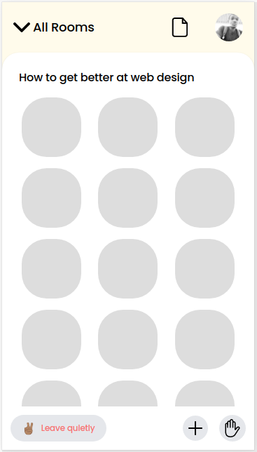

    

    <a href="#-idea">Idea</a>&nbsp;&nbsp;&nbsp;|&nbsp;&nbsp;&nbsp;
    <a href="#-techs">Techs</a>

 
  

## 💻 Idea

Clone of [club house](https://pt.wikipedia.org/wiki/Clubhouse) app

## 🚀 Techs

- [HTML](https://www.w3schools.com/html/html_intro.asp)
- [Tailwind](https://tailwindcss.com/)

## 🧘🏿‍ Lesson learned

* Span
* Position fixed

## :memo: Licence

This project is under MIT Licence. Please refer to [LICENSE](LICENSE.md) file for more details.

---

Build with 💜 by [**Alan Camilo**](https://allancamilo.com) and inspired by [**Mayke Brito - Clone front end do Clubhouse com TailwindCSS**](https://www.youtube.com/watch?v=qz9k-m5cnP0) 
